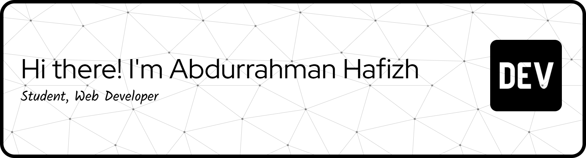

## Hi there 👋 I'm Abdurrahman Hafizh

<!--
**Abdurrahmanhafizh/Abdurrahmanhafizh** is a ✨ _special_ ✨ repository because its `README.md` (this file) appears on your GitHub profile.

Here are some ideas to get you started:

- 🔭 I’m currently working on ...
- 🌱 I’m currently learning ...
- 👯 I’m looking to collaborate on ...
- 🤔 I’m looking for help with ...
- 💬 Ask me about ...
- 📫 How to reach me: ...
- 😄 Pronouns: ...
- ⚡ Fun fact: ...
-->

- 🔭 I’m currently working on **decision support system**
- 🌱 I’m currently learning **Laravel 13** and **AI Agents**

#### Skills 

##### Tools

##### Github stats

##### Connect  With Me

<!-- Game Ular -->

###
